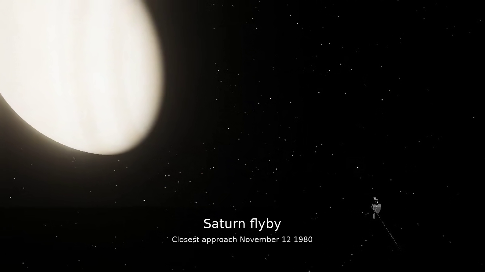

# Solar System Simulation — Fortran 2018 + OpenGL 4.1


> _The inner solar system at 1 day / second, rendered from Fortran through
> OpenGL 4.1: procedural Sun with bloom, 8 000-star celestial sphere, and
> a 15 000-object instanced asteroid belt._

A real-time solar system simulation written in modern **Fortran 2018** with
a rendering stack built directly on top of **OpenGL 4.1 Core** and **GLFW**.
The physics core is an N-body gravitational integrator seeded with full
J2000.0 Keplerian elements (a, e, i, Ω, ϖ, L) from Meeus Table 31.A and
verified for energy and angular-momentum conservation to ~10⁻⁹ % over an
Earth year. The rendering side is a full deferred-to-HDR pipeline with
procedural Sun, physically-plausible bloom, ACES tonemapping, textured
planets, Saturn's rings, a procedural starfield and a 15 000-object
instanced asteroid belt.

Everything the program needs — window management, OpenGL function loading,
image I/O, shader compilation, framebuffer setup — is wired up in Fortran
through `iso_c_binding`. There are no rendering wrapper libraries sitting
between Fortran and the driver.

---

## Contents

- [Gallery](#gallery)
- [Requirements](#requirements)
- [Install on Ubuntu / Debian / WSL2](#install-on-ubuntu--debian--wsl2)
- [Quick start](#quick-start)
- [Helper scripts](#helper-scripts)
- [Controls](#controls)
- [Spacecraft](#spacecraft)
- [Cinematic tools](#cinematic-tools)
- [Configuration (`config.toml`)](#configuration)
- [Project layout](#project-layout)
- [Why Fortran 2018](#why-fortran-2018)
- [How Fortran talks to OpenGL](#how-fortran-talks-to-opengl)
- [Deep dive: `TECHNICAL.md`](#technical-documentation)
- [Phase history](#phase-history)

---

## Gallery

| | |
|---|---|
|  |  |
| **Earth day/night terminator** — Blinn–Phong lighting, normal map, specular mask on the oceans, city-lights night texture blended across the terminator, and a thin atmospheric rim. | **Earth, night side** — the night-lights texture survives ACES tonemap at `exposure = 1.0`. Bloom is off for this shot so city glow stays crisp. |
|  |  |
| **Saturn and its rings** — textured ring disk with inner/outer radii, gradient transparency, self-shadowing against the planet body. | **Inner-system overview** — procedural Sun with HDR bloom, 8 000-star celestial sphere, and 15 000 asteroid belt instances between Mars and Jupiter. |

All four shots come from the same binary via the CLI flags below
(`--screenshot`, `--screenshot-earth`, `--screenshot-earth-night`,
`--screenshot-saturn`). No post-processing was applied outside the
simulator's own HDR pipeline.

---

## Requirements

To build from source you need:

- `gfortran` with Fortran 2018 support
- `cmake` 3.18+
- `make`
- `build-essential`
- `pkg-config`
- `libglfw3-dev`

The repo includes an Ubuntu/Debian package manifest at
`requirements/ubuntu-apt.txt`, and `./install.sh` uses that list directly.

## Install on Ubuntu / Debian / WSL2

### Fast path

```bash
git clone https://github.com/NoCoderRandom/SolarsystemFortran.git
cd SolarsystemFortran
./install.sh
./run.sh
```

`./install.sh` will:

- install the required apt packages on Debian-family systems
- configure a CMake build in `build/`
- compile the simulator
- run tests only if a local `tests/` directory exists

### WSL2 notes

This project works on WSL2 with Ubuntu. You need a working Linux GUI/OpenGL
path:

- On Windows 11, WSLg is usually enough out of the box.
- On older setups, use an X server / OpenGL-capable desktop path before
  launching the simulator window.

If you only want to install dependencies first:

```bash
./install.sh --deps-only
```

If your system packages are already installed:

```bash
./install.sh --no-apt
```

If you are on a non-Debian Linux distro, install the equivalent packages for
your package manager, then run:

```bash
./install.sh --no-apt
```

## Quick start

```bash
# One-shot setup for Ubuntu / Debian / WSL2.
./install.sh

# Launch the simulator from the project root.
# run.sh rebuilds first if sources, shaders, or spacecraft assets changed.
./run.sh
```

If you already have the toolchain, `./install.sh --no-apt` skips the package
step.

Alternatively:

```bash
mkdir -p build && cd build
cmake .. -DCMAKE_BUILD_TYPE=Release
cmake --build . -j
./solarsim
```

## Helper scripts

The repo ships with root-level helpers so people can install, build, and run
the simulator without learning the internal build layout first:

- `./install.sh` installs Debian / Ubuntu / WSL2 dependencies, configures CMake,
  builds the project, and runs tests when a local `tests/` directory exists
- `./build.sh` performs an explicit CMake build from the repo root; use
  `./build.sh release` for an optimized build or `./build.sh clean` to wipe
  `build/` first
- `./run.sh` launches the simulator from the correct working directory and
  rebuilds first when the binary is missing or older than `src/`, `shaders/`,
  or `assets/spacecraft/`

### Headless screenshots

The CLI takes optional flags that park the camera on a target, render for
180 frames, save a PNG, and exit — handy for regression shots and CI:

```bash
./run.sh --screenshot              # full overview
./run.sh --screenshot-earth        # Earth close-up (day/night terminator)
./run.sh --screenshot-earth-night  # Earth night side (city lights)
./run.sh --screenshot-saturn       # Saturn with rings
```

---

## Controls

| Key | Action |
|-----|--------|
| `0`–`8` | Focus camera on Sun / Mercury / … / Neptune |
| LMB drag | Orbit camera |
| RMB drag | Pan |
| Scroll wheel | Zoom (logarithmic) |
| `R` | Reset camera |
| `SPACE` | Pause / resume |
| `+` / `-` | Time scale ×2 / ÷2 (1 s/s → 10 yr/s) |
| `T` | Toggle orbit trails (`Shift+T` clears) |
| `H` | Toggle HUD overlay |
| `B` | Toggle bloom |
| `[` / `]` | Exposure down / up |
| `F2` | Timestamped screenshot → `screenshots/solarsim_YYYYMMDD_HHMMSS.png` |
| `F12` | Overwrite screenshot at the configured preset path |
| `ESC` | Quit |

A top-bar **menu** (File / View / Camera / Help) sits above the viewport
and mirrors the hotkeys with clickable checkboxes and buttons. Under
**View** you'll find toggles for trails, HUD, bloom, and **Log-Scale
Distances** — a visual-only radial compression around the Sun
(`r' = K · log₁₀(1 + r)`) that gives the inner planets breathing room so
the whole system fits a textbook-style layout without touching the
physics. Planets, rings, asteroids and trails all share the same remap so
orbits stay coherent; toggle it at runtime to flip between real-scale and
textbook-scale views.

On shutdown the program prints a per-slot performance report (physics,
scene render, starfield, planets, asteroids, trails, bloom+tonemap) with
average and peak frame times.

### Spacecraft Controls

When spacecraft are enabled, the `Spacecraft` top-bar menu exposes:

- enable / disable spacecraft
- select active ship
- spawn at `Earth`, `Sun`, or `Current Focus`
- reset / despawn the active ship
- switch between `System` and `Follow` camera modes

Keyboard controls for the active spacecraft:

| Key | Action |
|-----|--------|
| `W` / `S` | Thrust forward / backward |
| `A` / `D` | Yaw left / right |
| `Up` / `Down` | Pitch up / down |
| `Q` / `E` | Roll left / right |
| `C` | Toggle inspect orbit camera while follow camera is active |
| `F` | Toggle spacecraft auto-stabilize |
| `N` / `M` | Previous / next spacecraft |

The HUD shows the selected spacecraft name, ship speed, camera mode, and
auto-stabilize state when spacecraft are enabled and a ship is active.

## Spacecraft

The spacecraft system is modular and kept separate from the planetary renderer
and physics. When enabled, it adds:

- separate asset loading and rendering from planets and spheres
- menu-driven ship selection and spawn presets
- third-person follow camera
- inertial spacecraft controls that do not touch planetary physics
- per-ship follow and visual tuning from the catalog

Current drivable catalog:

- `Voyager 1`
- `USS Voyager`
- `USS Enterprise NCC-1701`

Additional imported assets are already in the repo and can be promoted later
through the catalog:

- `Klingon Bird-of-Prey`
- `Negh'Var`
- `Intrepid-type` import

Menu behavior today:

- `NASA` catalog entries appear automatically under the `Real` submenu
- `Star Trek` catalog entries appear automatically under the `Trek` submenu
- new franchise groups can be added by extending the menu builder in `src/main.f90`

### Spacecraft and Movie Gallery

| | |
|---|---|
|  |  |
| **Enterprise blue pass** — a close atmospheric Earth shot from the Trek movie set, useful as a clean reference for scale, lighting, and ship framing. | **Trek reel hero frame** — a stronger README hero-style still showing the follow camera and night-side Earth lighting working together. |
|  |  |
| **Mars convoy** — multiple ships in one frame with enough standoff distance to keep planets reading believably in the shot. | **Voyager Saturn story frame** — the educational real-space pipeline with captions, composition, and x265 delivery output. |

Spacecraft documentation:

- [Add new spacecraft tutorial](movies/docs/ADD_NEW_SPACECRAFT.md)
- [Importing new models](movies/docs/IMPORT_NEW_MODELS.md)
- [Drive and capture guide](movies/docs/DRIVE_AND_CAPTURE.md)
- [Shot authoring guide](movies/docs/SHOT_AUTHORING.md)
- [Model integration and orientation paper](movies/papers/MODEL_INTEGRATION_AND_ORIENTATION.md)
- [Imported asset notes](assets/spacecraft/imported/README.md)

---

## Cinematic Tools

The repo now includes a separate movie-production workspace under
[`movies/`](movies/README.md). It is designed to stay modular so people can
render new social clips, educational reels, and future spacecraft showcases
without disturbing the core simulator flow.

Shipped outputs include:

- Trek-style master clips and a 1-minute reel
- real-space Voyager clips and a 1-minute reel
- a captioned educational Voyager story film

Useful entry points:

```bash
# Render one cinematic shot
bash movies/render_one.sh earth_convoy movies/output/singles

# Render a full batch and assemble a reel
bash movies/render_movies.sh movies/output/trek_batch

# Recut a final reel from existing clips
bash movies/compile_best_of.sh movies/output/20260422_trek movies/trek_reel_plan.tsv best_of_1min.mp4
```

Main movie docs:

- [Cinematic movie side project](movies/README.md)
- [AI coder workflows](movies/docs/AI_CODERS.md)
- [Manifests and reel editing](movies/docs/MANIFESTS_AND_REELS.md)
- [Troubleshooting guide](movies/docs/TROUBLESHOOTING.md)

## Configuration

First launch writes `build/config.toml` with the defaults the build was
shipped with. Edit and restart to tune:

```toml
[window]
width  = 1600
height = 900
vsync  = true

[simulation]
time_scale     = 86400.0    # simulated seconds per real second (1 day/s)
trail_length   = 4096
trails_visible = true
hud_visible    = true
focus_index    = 0          # 0=Sun, 1=Mercury … 8=Neptune

[camera]
azimuth   = 0.000
elevation = 0.800
log_dist  = 1.778

[bloom]
on        = true
threshold = 1.000
intensity = 0.850
mips      = 5

[tonemap]
exposure         = 1.000
sun_emissive_mul = 3.500

[starfield]
count     = 8000
intensity = 1.000

[asteroids]
count = 15000
a_min = 2.200    # AU
a_max = 3.300    # AU

[textures]
earth_night    = true
earth_normal   = true
earth_specular = true
saturn_rings   = true

[spacecraft]
enabled         = false
camera_mode     = 0        # 0=System, 1=Follow
auto_stabilize  = true
default_id      = "voyager1"
spawn_preset    = "earth"  # earth | sun | focus
```

Unknown keys are warned and ignored. The parser is a minimal, handwritten
TOML subset with simple named tables and scalar key/value pairs.

---

## Project layout

```
SolarsystemFortran/
├── install.sh               # Linux / WSL2 dependency install + build helper
├── build.sh                 # explicit root-level CMake build wrapper
├── requirements/
│   └── ubuntu-apt.txt       # apt packages consumed by install.sh
├── run.sh                   # launch wrapper with stale-build detection
├── CMakeLists.txt           # solarsim target + optional ctest + asset copy
├── README.md                # you are here
├── TECHNICAL.md             # methods, algorithms, Fortran↔GL interop
├── src/
│   ├── core/
│   │   ├── logging.f90      # coloured, timestamped logging
│   │   ├── constants.f90    # physical constants (G, AU, …)
│   │   ├── vector3d.f90     # real64 3-vector with operator overloads
│   │   ├── date_utils.f90   # J2000 → Gregorian conversion
│   │   ├── input.f90        # keyboard / mouse / scroll state + callbacks
│   │   ├── config.f90       # sim_config_t, tunables, clamps
│   │   ├── config_toml.f90  # minimal TOML reader/writer
│   │   └── perf.f90         # CPU timing slots (tic/toc/report)
│   ├── ui/
│   │   └── menu.f90         # top-bar menu + dropdowns + checkbox glyphs
│   ├── physics/
│   │   ├── body.f90         # body_t — name, mass, radius, colour, state
│   │   ├── ephemerides.f90  # J2000 Keplerian elements → Cartesian state
│   │   ├── integrator.f90   # Velocity Verlet, Plummer softening
│   │   └── simulation.f90   # owns bodies, drives integrator
│   ├── render/
│   │   ├── gl_bindings.f90  # iso_c_binding layer for GLFW/GL/GLAD + stb_image
│   │   ├── window.f90       # context init, vsync, callbacks
│   │   ├── mat4.f90         # column-vector mat4 math (proj, view, model)
│   │   ├── mesh.f90         # UV sphere generator + instanced draw setup
│   │   ├── shader.f90       # compile/link/uniform helpers
│   │   ├── framebuffer.f90  # RGBA16F FBO + mipchain attachments
│   │   ├── texture.f90      # stb_image → GL texture with sRGB / linear modes
│   │   ├── material.f90     # per-body material (albedo, normal, night, spec)
│   │   ├── camera.f90       # orbit camera, logarithmic zoom, smooth focus
│   │   ├── display_scale.f90# render-time log radial remap (visual only)
│   │   ├── sun.f90          # procedural Sun surface + corona
│   │   ├── rings.f90        # Saturn's rings (textured disk)
│   │   ├── trails.f90       # GPU-buffered fading orbit ribbons
│   │   ├── starfield.f90    # 8k-star celestial sphere
│   │   ├── asteroids.f90    # instanced asteroid belt
│   │   ├── hud_text.f90     # bitmap font HUD
│   │   ├── post.f90         # bright pass + dual-filter blur + ACES
│   │   └── renderer.f90     # per-frame orchestration
│   └── main.f90             # lifecycle + main loop
├── shaders/                 # GLSL 410 core (.vert / .frag pairs)
├── assets/
│   ├── spacecraft/          # source/imported ship assets + runtime meshes
│   └── planets/             # 2k surface maps (see NOTICE in assets/)
├── external/
│   ├── glad/                # OpenGL function loader (vendored)
│   └── stb/                 # stb_image.h for PNG/JPG decode (vendored)
├── movies/                  # modular cinematic side-project and docs
└── screenshots/             # reference renders per phase
```

---

## Why Fortran 2018

Fortran has an unfair reputation as a "legacy" language. The 2018 standard
is modern, strict, and extremely well suited to a project like this:

**Numeric rigour.** Every `real(real64)` is 64-bit IEEE 754 with no
surprises from C's implicit promotions. Physics conservation tests pass to
~10⁻⁹ % energy drift over a simulated year at 1-hour Verlet timestep —
the integrator is doing exactly what the math says it should, because the
language carries the math literally.

**Strong module system.** Each file is a `module` with explicit `private`
defaults and curated `public` lists. `use :: foo, only: bar` stops
accidental symbol leakage at the compiler level, not at code-review level.
No headers, no textual inclusion, no preprocessor macros — just a graph of
modules the compiler resolves into `.mod` files.

**Derived types with bound procedures.** Fortran 2003/2008 OOP is light but
sufficient. `simulation_t`, `camera_t`, `renderer_t`, `post_t` etc. are
plain structs with type-bound subroutines; no vtables are forced on you
unless you opt into polymorphism. Value semantics + explicit `intent(in /
out / inout)` catches aliasing bugs at compile time.

**Array-first syntax.** Whole-array operations (`a = b + c * 2.0`,
`sum(arr)`, `pack`, `spread`) generate tight, vectorisable code — the
compiler knows shapes and strides up front because the language does.

**C interop via `iso_c_binding`.** The standard-mandated module gives you
`c_int`, `c_float`, `c_ptr`, `c_funptr`, `c_loc`, `c_funloc`, and the
`bind(c, name="…")` attribute. That's literally everything needed to call
OpenGL, GLFW, GLAD, and stb_image directly. No SWIG, no wrapper generator,
no FFI DSL. You write the C prototype as a Fortran interface and link.

**Performance parity with C.** The physics loop, matrix math, and starfield
/ asteroid mesh generation all compile to the same SSE/AVX-capable machine
code a C translation would, because both go through the same gcc backend.
For tight inner loops the compiler often does better with Fortran's aliasing
guarantees than it can with C's `restrict` annotations.

**Plays well with GPUs.** Once data is laid out as a plain `real(c_float),
target :: verts(:)`, `c_loc(verts(1))` hands a pointer straight to
`glBufferData` — there's no marshalling, no copy, no managed heap. The VBO
upload is the same `memcpy` it would be from C. The CPU side stays in
Fortran; the GPU side stays in GLSL; `glGetUniformLocation` + a handful of
`glUniform*` bindings is all the glue you need.

In practical terms: the code reads as plainly as the equations it
implements, the compiler catches more mistakes than a C or C++ compiler
would, and the runtime is as fast as anything you could write in C.

---

## How Fortran talks to OpenGL

There is no GL binding library on any package manager for Fortran — so
the simulator builds one. The `gl_bindings` module is a ~650-line layer
that declares each GLFW / GL / GLAD / stb_image function you use as a
Fortran `interface` with a `bind(c, name="…")` attribute, e.g.:

```fortran
interface
    function glCreateShader(shader_type) result(id) &
            bind(c, name="glCreateShader")
        import :: c_int
        integer(c_int), value, intent(in) :: shader_type
        integer(c_int) :: id
    end function glCreateShader
end interface
```

After that declaration the rest of the program just calls `glCreateShader`
as if it were a Fortran function. The same pattern covers buffer objects,
VAOs, textures, framebuffers, callbacks (`c_funloc` wraps a Fortran
`bind(c)` procedure into a `c_funptr` GLFW accepts), and GLAD's function
loader.

See **[TECHNICAL.md](TECHNICAL.md)** for a full tour: binding patterns,
pointer handling, the matrix convention, the HDR pipeline, the Verlet
integrator, the starfield / asteroid mesh generators, and the ACES tonemap.

---

## Technical documentation

The companion file **[TECHNICAL.md](TECHNICAL.md)** covers:

- Fortran ↔ C interop patterns (scalars, arrays, pointers, callbacks)
- OpenGL 4.1 pipeline bring-up in Fortran
- The Velocity Verlet N-body integrator and Plummer softening
- J2000 initial conditions and heliocentric → barycentric correction
- The column-vector `mat4` convention (and a past bug worth documenting)
- HDR pipeline: RGBA16F scene target, bright pass, dual-filter blur,
  ACES (Narkowicz 2015) tonemap
- Blinn–Phong + normal map + night lights + specular mask for Earth
- Starfield and asteroid belt generation (seeded RNG, Keplerian orbits)
- Trail ring buffers (GPU-side fade via `gl_MultiDrawArrays`)
- Timestep decoupling (accumulator + interpolation for smooth rendering)

It's written for readers who want to learn either Fortran→GL interop or
real-time graphics fundamentals.

---

## Phase history

| Phase | Scope                                                     |
|-------|-----------------------------------------------------------|
| 1     | Foundation: window, logging, CMake                        |
| 2     | Physics: bodies, J2000, Velocity Verlet engine            |
| 3     | Renderer: instanced spheres, mat4 pipeline                |
| 4     | Camera: orbit camera, HUD, input                          |
| 5     | Trails: GPU-buffered fading orbit trails                  |
| 6     | HDR pipeline, bloom, ACES tonemap, procedural Sun         |
| 7     | Textures: planet surfaces, normals, Earth night/specular, Saturn rings |
| 8     | Polish: starfield, asteroid belt, `config.toml`, perf timers |

Each phase is a self-contained commit with a verifiable demo.

---

## Tech stack

| Component | Choice |
|-----------|--------|
| Language | Fortran 2018 (`-std=f2018 -Wall -Wextra -Werror` in Debug) |
| Graphics API | OpenGL 4.1 Core Profile |
| Windowing | GLFW 3.3+ |
| GL Loader | GLAD (vendored, minimal) |
| Image decode | stb_image (vendored, single-header) |
| Build system | CMake 3.18+ |
| Compiler | gfortran ≥ 9 |
| Target platforms | Linux, WSL2, native NVIDIA / Mesa drivers |

## License

This repository is authored by **[NoCoderRandom](https://github.com/NoCoderRandom)**.

Planet surface textures bundled under `assets/planets/` are 2K maps from
Solar System Scope ([solarsystemscope.com/textures](https://www.solarsystemscope.com/textures/)),
released under the Creative Commons Attribution 4.0 license. All first-party
code is released under the MIT License — see `LICENSE`.
