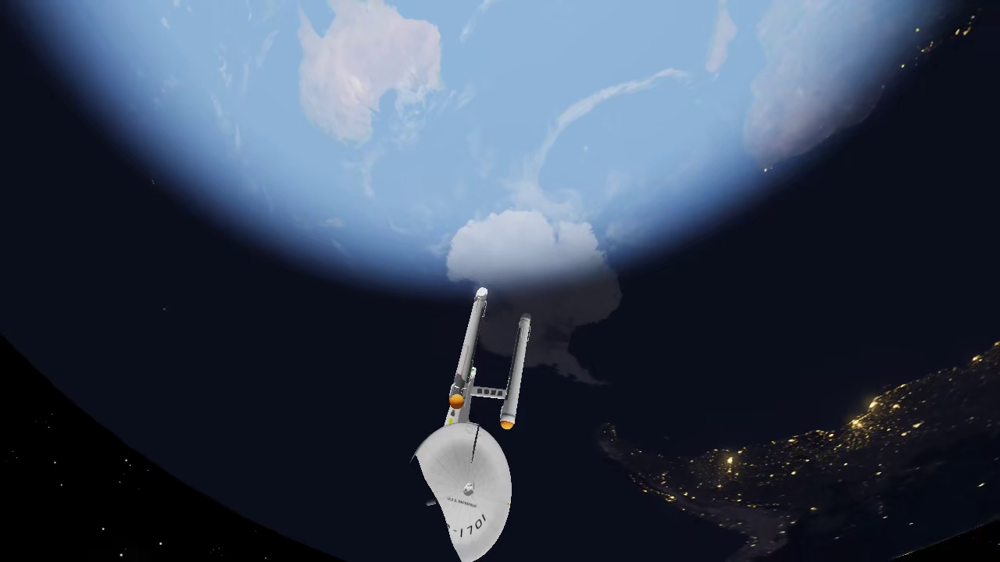
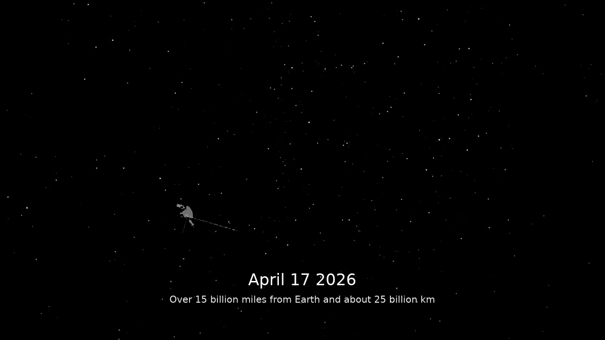

# Cinematic Movie Side Project

This folder is the isolated movie-production workspace for the spacecraft and cinematic demo extension. It keeps shot manifests, capture scripts, reel assembly, captions, research, and documentation together so the core simulator can stay focused on rendering and simulation.



## What shipped

- Trek master clips: `movies/output/20260422_trek/clips/*.mp4`
- Trek 1-minute social cut: `movies/output/20260422_trek/best_of_1min.mp4`
- Real-space master clips: `movies/output/20260422_real/clips/*.mp4`
- Real-space 1-minute reel: `movies/output/20260422_real/real_best_of_1min.mp4`
- Captioned educational Voyager film: `movies/output/20260422_real/voyager_journey_story.mp4`

All shipped MP4s in this side project are small enough for repo distribution in their current x265 form. The final reels are roughly 3 MB to 5 MB each.


## Why this folder exists

- Keep movie workflow changes separate from the main simulation UX.
- Make the render pipeline easy for AI coding agents to edit safely.
- Support both fun franchise reels and factual educational videos.
- Preserve reusable manifests, captions, and render settings for later batches.

## Quick Start

Render the Trek package:

```bash
bash movies/render_movies.sh movies/output/trek_batch
```

Render the real-space package:

```bash
bash movies/render_movies.sh movies/output/real_batch movies/real_plan.tsv real_best_of_1min.mp4
```

Render one shot:

```bash
bash movies/render_one.sh earth_convoy movies/output/singles
```

Rebuild a reel from existing master clips:

```bash
bash movies/compile_best_of.sh movies/output/20260422_trek movies/trek_reel_plan.tsv best_of_1min.mp4
```

Burn educational captions into a finished clip:

```bash
bash movies/annotate_with_captions.sh \
    movies/output/20260422_real/clips/02_voyager_journey.mp4 \
    movies/captions/voyager_story.tsv \
    movies/output/20260422_real/voyager_journey_story.mp4
```

## Documentation Map

- [AI coder workflows](docs/AI_CODERS.md)
- [Drive and capture guide](docs/DRIVE_AND_CAPTURE.md)
- [Shot authoring guide](docs/SHOT_AUTHORING.md)
- [Importing new models](docs/IMPORT_NEW_MODELS.md)
- [Manifests and reel editing](docs/MANIFESTS_AND_REELS.md)
- [Troubleshooting guide](docs/TROUBLESHOOTING.md)
- [Cinematic side-project whitepaper](papers/CINEMATIC_SIDE_PROJECT_WHITEPAPER.md)
- [AI-assisted movie production note](papers/AI_ASSISTED_MOVIE_PRODUCTION.md)
- [Model integration and orientation paper](papers/MODEL_INTEGRATION_AND_ORIENTATION.md)

## Current Files

- `config/cinematic_720p.toml`
  - stable render config for repeatable 720p x265 capture
- `shot_plan.tsv`
  - Trek master-shot manifest
- `trek_reel_plan.tsv`
  - curated Trek final-cut manifest
- `real_plan.tsv`
  - real-space master-shot manifest
- `captions/voyager_story.tsv`
  - timed overlay text for the educational Voyager film
- `render_movies.sh`
  - batch render a manifest and compile a reel
- `render_one.sh`
  - render a single named shot
- `compile_best_of.sh`
  - trim and concatenate existing clips into a final cut
- `annotate_with_captions.sh`
  - burn time-based text overlays into a finished clip
- `docs/SHOT_AUTHORING.md`
  - how to add and tune new cinematic demo shots
- `docs/TROUBLESHOOTING.md`
  - render-path, ffmpeg, and orientation debugging notes
- `research/voyager1_mission_notes.md`
  - factual notes and NASA source links for the Voyager story

## Agent-Friendly By Design

This side project works well with terminal-first AI coding agents because the control surface is plain text:

- TSV manifests define what gets rendered.
- TOML files define capture settings.
- Shell scripts define the repeatable render pipeline.
- Markdown files define the plan, research, and output packaging.

That means tools such as OpenAI Codex, Claude Code, and Qwen-Coder style agents can all help with planning shots, editing manifests, refining captions, and shipping docs without needing a custom plugin.

## Code Surface

The movie folder is only one half of the system. These code files are the engine-side entry points:

- [`src/main.f90`](../src/main.f90)
- [`src/render/demo.f90`](../src/render/demo.f90)
- [`src/spacecraft/spacecraft_system.f90`](../src/spacecraft/spacecraft_system.f90)
- [`src/spacecraft/spacecraft_catalog.f90`](../src/spacecraft/spacecraft_catalog.f90)
- [`src/spacecraft/spacecraft_camera.f90`](../src/spacecraft/spacecraft_camera.f90)

Model conversion helpers live here:

- [`scripts/convert_spacecraft_glb.py`](../scripts/convert_spacecraft_glb.py)
- [`scripts/convert_spacecraft_obj.py`](../scripts/convert_spacecraft_obj.py)
- [`scripts/convert_spacecraft_3ds.py`](../scripts/convert_spacecraft_3ds.py)

## Recommended Use Cases

- Reddit-style cinematic teasers
- classroom explainers with text overlays
- outreach videos about real spacecraft and missions
- franchise fan reels and formation-flight showcases
- reusable shot-development work for future AI-assisted batches


