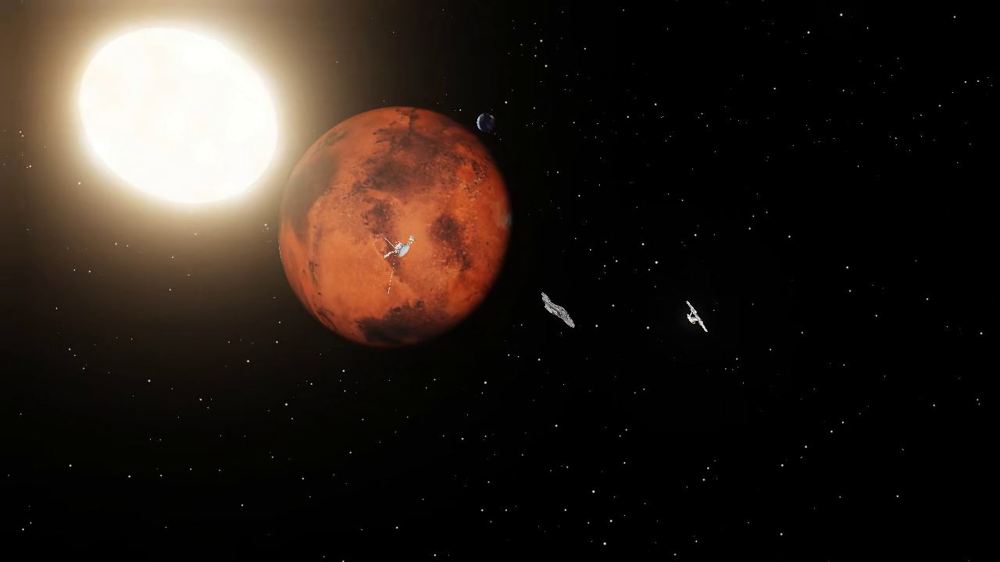

# Importing New Models



This project currently renders spacecraft from OBJ plus MTL assets that live under `assets/spacecraft/imported/`. That is the runtime contract to satisfy if you want a new ship to appear in movies or become drivable.

## Runtime Asset Contract

Each imported spacecraft should end up as:

```text
assets/spacecraft/imported/<pack>/<ship>/
  model.obj
  model.mtl
  textures...
  README.md
```

Important rules:

- keep texture paths relative
- do not depend on absolute host paths
- keep one ship per folder
- record source and conversion notes in `README.md`

See also:

- [`../../assets/spacecraft/README.md`](../../assets/spacecraft/README.md)
- [`../../assets/spacecraft/imported/README.md`](../../assets/spacecraft/imported/README.md)

## Source And Imported Trees

The usual flow is:

```text
assets/spacecraft/sources/...   -> raw downloads or source bundles
scripts/convert_spacecraft_*    -> normalize and export runtime OBJ
assets/spacecraft/imported/...  -> engine-ready runtime asset
src/spacecraft/spacecraft_catalog.f90 -> drivable catalog entry
```

## Supported Conversion Helpers

- [`../../scripts/convert_spacecraft_glb.py`](../../scripts/convert_spacecraft_glb.py)
- [`../../scripts/convert_spacecraft_obj.py`](../../scripts/convert_spacecraft_obj.py)
- [`../../scripts/convert_spacecraft_3ds.py`](../../scripts/convert_spacecraft_3ds.py)

These Blender batch scripts:

- import the source mesh
- optionally decimate it
- triangulate it
- center and normalize scale
- export runtime OBJ plus MTL

## Example Conversion Commands

GLB or glTF source:

```bash
blender -b -P scripts/convert_spacecraft_glb.py -- \
  --input assets/spacecraft/sources/real/new_probe/source.glb \
  --output assets/spacecraft/imported/real/new_probe/model.obj \
  --target-extent 2.0 \
  --decimate-ratio 0.35
```

OBJ source:

```bash
blender -b -P scripts/convert_spacecraft_obj.py -- \
  --input assets/spacecraft/sources/trek/new_ship/source.obj \
  --output assets/spacecraft/imported/trek/new_ship/model.obj \
  --target-extent 2.0
```

3DS source:

```bash
blender -b -P scripts/convert_spacecraft_3ds.py -- \
  --input assets/spacecraft/sources/trek/new_ship/source.3ds \
  --output assets/spacecraft/imported/trek/new_ship/model.obj \
  --target-extent 2.0
```

## Ship README Template

Each imported asset should include:

- source URL
- author or origin
- license direction
- conversion tool and settings
- scale notes
- orientation notes

You can use [`../../assets/spacecraft/imported/real/voyager1/README.md`](../../assets/spacecraft/imported/real/voyager1/README.md) as a model.

## Register The Ship In The Catalog

To make a ship drivable and selectable, add it to [`../../src/spacecraft/spacecraft_catalog.f90`](../../src/spacecraft/spacecraft_catalog.f90).

You will usually need to:

1. increase `SPACECRAFT_CATALOG_COUNT`
2. add a `spacecraft_catalog_init_entry(...)` call
3. tune visual scale and follow-camera offsets
4. tune `model_pitch` and `model_yaw` until the ship reads nose-first

Example pattern:

```fortran
call spacecraft_catalog_init_entry(entries(4), "new_ship", "New Ship", "Custom", &
                                   "starship", "assets/spacecraft/imported/custom/new_ship/model.obj", &
                                   "assets/spacecraft/imported/custom/new_ship/README.md", &
                                   "earth", 2.10_real32, 0.18_real32, 0.04_real32, &
                                   -1.570796_real32, 0.6_real32)
```

## Tuning Orientation

The practical reality is that imported meshes do not share one universal front/up axis.

Use these fields for first-pass correction:

- `visual_scale`
- `follow_distance`
- `follow_height`
- `model_pitch`
- `model_yaw`

If a ship still looks wrong in motion:

- render a single smoke clip
- check whether thrust looks nose-first
- adjust `model_pitch` and `model_yaw`
- repeat before using the ship in a batch reel

## Smoke Test Checklist

After import:

1. build the app
2. select the new ship in the catalog
3. spawn near Earth
4. verify the mesh loads without missing local texture paths
5. check follow camera readability
6. record one short shot before adding it to a larger manifest

Useful commands:

```bash
cmake --build build -j 4
bash movies/render_one.sh earth_convoy movies/output/smoke
```

For a new ship, swap the selected catalog entry first, then use follow camera or a dedicated smoke shot.

## Important Current Limitation

The runtime can render more assets than the current drivable catalog exposes. Imported folders alone do not make a ship selectable. The catalog is the gate between "asset exists" and "pilot can spawn it".
