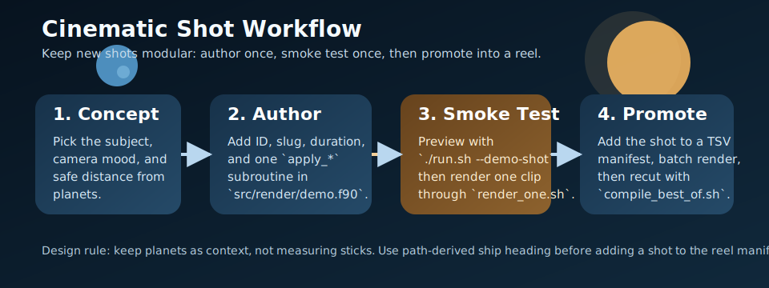

# Shot Authoring Guide



This guide is for adding new cinematic shots without turning the movie side project into a one-off hack. The goal is to keep new work easy to render, easy to review, and safe to reuse in later reels.

## Where A Shot Lives

The engine-side shot director is [`../../src/render/demo.f90`](../../src/render/demo.f90). A reusable shot usually touches four places in that file:

- `DEMO_COUNT`, `DEMO_ID_*`, `DEMO_NAMES`, and `DEMO_SLUGS`
- `demo_apply(...)`, which dispatches by shot ID
- `demo_duration_for(...)`, which defines clip length
- one new `apply_<shot_name>(...)` subroutine that places the camera and ships

The CLI entry points are already wired in [`../../src/main.f90`](../../src/main.f90), so a new slug becomes callable through:

```bash
./run.sh --demo-shot your_new_slug
./run.sh --demo-record-shot your_new_slug /tmp/shot.mp4 /tmp/shot_frames
```

## Fast Authoring Loop

Use this order:

1. Add the shot in `demo.f90`.
2. Preview it interactively with `./run.sh --demo-shot <slug>`.
3. Render one encoded smoke clip with `bash movies/render_one.sh <slug> movies/output/smoke`.
4. Only after the shot reads clearly, add it to `shot_plan.tsv` or another manifest.

That keeps bad camera ideas out of the bigger batch.

## The Smallest Useful Change Set

### 1. Register The ID And Slug

Add one new constant, name, and slug beside the existing cinematic entries:

```fortran
integer, parameter :: DEMO_ID_RING_SWEEP = 17

character(len=32), parameter :: DEMO_NAMES(DEMO_COUNT) = [ character(len=32) :: &
    ...,
    "Cinematic: Ring Sweep" ]

character(len=32), parameter :: DEMO_SLUGS(DEMO_COUNT) = [ character(len=32) :: &
    ...,
    "ring_sweep" ]
```

`demo_resolve_id(...)` already accepts numeric IDs, slugs, and display names, so you do not need extra parsing code.

### 2. Dispatch The Shot

Add one branch in `demo_apply(...)`:

```fortran
case (DEMO_ID_RING_SWEEP)
    call apply_ring_sweep(state, cam, bodies, focus_index, overlay)
```

### 3. Set The Duration

Add the shot to `demo_duration_for(...)`. Most of the cinematic clips in this repo stay in the 30 to 48 second range, which is enough to feel intentional without wasting render time.

### 4. Implement The Camera And Ship Motion

The most reusable pattern is:

1. pick a body or pair of bodies
2. build a local basis from that geometry
3. evaluate a camera path and one or more ship paths
4. look slightly ahead or slightly inward instead of directly at the ship center
5. stage the ships from path deltas so they read nose-first

## Helper Functions Worth Reusing

These helpers already exist in [`../../src/render/demo.f90`](../../src/render/demo.f90):

- `basis_from_reference(center, reference, axis_x, axis_y, axis_z)`
  - creates a stable local frame from a planet and a reference point such as the Sun
- `orbit_path(center, axis_x, axis_y, axis_z, radius_x, radius_y, vertical_amp, t)`
  - creates a clean orbital-style path without hand-writing three coordinate equations every time
- `direction_from_points(a, b, fallback)`
  - turns path motion into a normalized heading vector
- `direction_to_angles(direction, yaw, pitch)`
  - converts that heading to the renderer-facing yaw and pitch values
- `stage_ship_from_path(...)`
  - the highest-value helper for cinematic shots; it derives heading from `world_pos_au` and `next_pos_au`, then stores the demo pose
- `set_camera_focus(cam, focus)`
  - snaps focus state cleanly for hard-authored shots

## Reference Pattern: Formation Flight

[`../../src/render/demo.f90`](../../src/render/demo.f90) already has a strong pattern in `apply_earth_convoy(...)`:

- create one Earth-centric basis from `basis_from_reference(...)`
- sample one lead path and two wing paths with `orbit_path(...)`
- derive a forward vector from `lead` to `lead_next`
- place the camera slightly behind and offset from that direction
- call `stage_ship_from_path(...)` three times for the convoy

That pattern is the fastest way to make 2 to 3 ships share a shot without all of them sliding sideways.

## Minimal Shot Skeleton

This is the smallest Fortran template that matches the existing movie code style:

```fortran
subroutine apply_ring_sweep(state, cam, bodies, focus_index, overlay)
    type(demo_state_t), intent(in) :: state
    type(camera_t), intent(inout) :: cam
    type(body_t), intent(in) :: bodies(:)
    integer, intent(out) :: focus_index
    type(demo_overlay_t), intent(inout) :: overlay
    real(c_float) :: saturn(3), sun(3), axis_x(3), axis_y(3), axis_z(3)
    real(c_float) :: ship(3), ship_next(3), ship_dir(3), eye_pos(3), look_target(3), t

    saturn = body_position_au(bodies, BODY_SATURN)
    sun = body_position_au(bodies, BODY_SUN)
    call basis_from_reference(saturn, sun, axis_x, axis_y, axis_z)
    t = wrapped_phase(state)

    ship = orbit_path(saturn, axis_x, axis_y, axis_z, 0.72_c_float, 0.40_c_float, 0.08_c_float, t)
    ship_next = orbit_path(saturn, axis_x, axis_y, axis_z, 0.72_c_float, 0.40_c_float, 0.08_c_float, &
                           min(t + 0.01_c_float, 1.0_c_float))
    ship_dir = direction_from_points(ship, ship_next, axis_y)

    eye_pos = ship - 0.014_c_float * ship_dir - 0.020_c_float * axis_y + 0.010_c_float * axis_z
    look_target = lerp3(ship, saturn, 0.10_c_float)

    call set_camera_focus(cam, look_target)
    cam%eye = eye_pos
    cam%view_up = axis_z
    cam%eye_override = .true.
    focus_index = BODY_SATURN

    call stage_ship_from_path(overlay, SHIP_ENTERPRISE, ship, ship_next, 0.0010_c_float, 0.02_c_float)
end subroutine apply_ring_sweep
```

## Scale Discipline

The easiest way to break the illusion is to park the camera so close to a planet that the audience can compare ship size to the planetary mesh directly.

For this repo, the safer pattern is:

- stay far enough back that the planet reads as background mass, not a measured surface
- favor oblique angles over dead-on center framing
- keep ships in the foreground third or middle third of the frame
- use camera drift and parallax instead of brute-force proximity

## Before You Add A Shot To A Manifest

Check these four things:

- the ship reads as flying nose-first, not sideways
- the camera has a clear subject and does not hover aimlessly
- the planet feels large but not inspectably small
- the shot differs from the others in axis, pacing, or composition

If the shot passes, add one row to [`../shot_plan.tsv`](../shot_plan.tsv) or another manifest and let the reel editor decide whether it survives the final cut.

## Related Guides

- [Drive and capture guide](DRIVE_AND_CAPTURE.md)
- [Manifests and reel editing](MANIFESTS_AND_REELS.md)
- [Troubleshooting guide](TROUBLESHOOTING.md)
