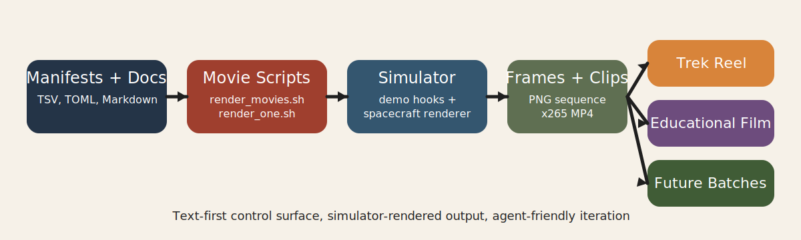

# Cinematic Side Project Whitepaper



## Abstract

This side project extends the solar-system simulator with a lightweight cinematic pipeline for spacecraft reels, educational overlays, and repeatable x265 output. The design goal was to add movie-making capability without turning the main project into a video editor. The resulting system uses a small set of shell scripts, manifests, and demo hooks to produce reusable cinematic outputs while preserving the simulator as the rendering engine.

## Design Goals

- keep the movie workflow isolated and reproducible
- preserve the original simulator as the main product
- support both factual and playful outputs
- allow AI coding agents to contribute safely
- keep final deliverables small enough for repo distribution

## System Overview

The movie stack has three layers:

1. engine-side cinematic hooks in [`../../src/main.f90`](../../src/main.f90) and [`../../src/render/demo.f90`](../../src/render/demo.f90)
2. spacecraft rendering and follow-camera support in [`../../src/spacecraft`](../../src/spacecraft)
3. side-project orchestration in [`../`](../)

The side-project layer is responsible for:

- batch shot scheduling
- deterministic capture settings
- reel assembly
- educational text overlays
- research notes and documentation

## Why The Pipeline Is Manifest-Driven

The use of TSV manifests is a deliberate systems choice:

- TSV is easy to edit by hand.
- TSV is easy for AI coders to reason about.
- Reel timing can change without re-rendering footage.
- Review can focus on composition instead of hidden state.

This makes the system closer to a small editorial pipeline than a hard-coded demo menu.

## Technical Architecture

### Capture

The runtime supports:

```text
./run.sh --demo-shot <slug>
./run.sh --demo-record-shot <slug> <clip.mp4> <frames_dir>
```

The side-project scripts wrap those engine commands:

- [`../render_movies.sh`](../render_movies.sh)
- [`../render_one.sh`](../render_one.sh)
- [`../compile_best_of.sh`](../compile_best_of.sh)
- [`../annotate_with_captions.sh`](../annotate_with_captions.sh)

### Rendering

The engine renders planets, sun, starfield, asteroids, and spacecraft together. The cinematic overlay path in [`../../src/render/demo.f90`](../../src/render/demo.f90) can stage multiple ships in explicit positions for convoy and formation shots.

### Spacecraft

The spacecraft system was adapted so multiple craft models can be loaded and rendered in the same scene. Demo overlays can override runtime positions and orientations without changing the general manual-flight path.

## Visual Strategy

The project intentionally avoids pushing ships too close to planets. That tradeoff reduces the risk that viewers notice the simplified scale relationship between planets and spacecraft. It also helps the shots read more like cinematic illustrations than forensic scale studies.

The recurring shot language used here is:

- wide planetary reveal
- ship convoy
- hero follow
- orbit or inspect framing
- educational caption pass for real-space stories

## Educational Mode

The real-space branch adds research-backed captions on top of the same rendering pipeline. In the Voyager story film, visual beats are paired with timed overlay text rather than voiceover. This keeps the delivery compact, silent-friendly, and suitable for short-form sharing.

Reference material for the current film lives in [`../research/voyager1_mission_notes.md`](../research/voyager1_mission_notes.md).

## Compression And Packaging

All current final outputs are encoded with x265 and tagged as `hvc1` for practical playback compatibility. This choice kept the final deliverables small enough to ship in the repository while still preserving useful visual quality.

Approximate delivered sizes:

- Trek 1-minute reel: about 5 MB
- Real-space 1-minute reel: about 4 MB
- Captioned Voyager film: about 3 MB

## Agent Compatibility

This side project is unusually compatible with AI coding agents because its control plane is mostly text and shell:

- manifests
- captions
- config files
- scripts
- Markdown docs

That allows tools such as Codex, Claude Code, and Qwen-Coder style agents to work productively on planning, editing, packaging, and documentation without requiring a separate DCC plugin or custom orchestration layer.

## Constraints

- local mesh axes still require per-model tuning for perfect nose-first motion
- some imported ships exist but are not yet cataloged as drivable
- educational overlays still rely on human review of factual timing and wording

## Future Work

- add more drivable catalog entries from the imported ship pool
- add a reusable shot-scoring pass for frame sampling
- add per-ship orientation correction presets
- add optional 1080p and vertical-video output presets
- add richer educational overlays such as lower-thirds and map-style annotations
