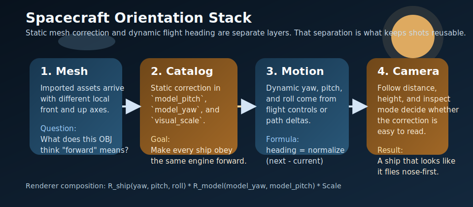

# Model Integration And Orientation



## Abstract

This note describes how the movie side project turns mixed-origin spacecraft meshes into shots that read as intentional flight instead of drifting props. The key idea is to separate per-model correction from per-shot motion heading, then compose them in a predictable render path.

## Problem Statement

Imported spacecraft do not share one canonical local frame:

- one mesh may point forward on `+Z`
- another may point forward on `+X`
- another may arrive pitched 90 degrees off its expected top axis

If the engine assumes one universal front and up direction, some ships will always look wrong. In a movie pipeline that is fatal because sideways motion reads instantly as fake.

## Runtime Layers

The current runtime uses three orientation layers.

### 1. Catalog-Level Mesh Correction

[`../../src/spacecraft/spacecraft_catalog.f90`](../../src/spacecraft/spacecraft_catalog.f90) stores the static correction data that belongs to the asset itself:

- `visual_scale`
- `follow_distance`
- `follow_height`
- `model_pitch`
- `model_yaw`

These values answer the question: "What transform does this mesh need before it can behave like a ship in this engine?"

### 2. Motion-Level Ship Heading

There are two sources for dynamic heading:

- free flight, where yaw, pitch, and roll come from player control in [`../../src/spacecraft/spacecraft_system.f90`](../../src/spacecraft/spacecraft_system.f90)
- cinematic overlay shots, where heading is derived from path motion in [`../../src/render/demo.f90`](../../src/render/demo.f90)

The cinematic path is especially important for movie work. `stage_ship_from_path(...)` computes:

```text
direction = normalize(next_pos_au - world_pos_au)
yaw       = atan2(direction.x, direction.z)
pitch     = atan2(direction.y, sqrt(direction.x^2 + direction.z^2))
```

That gives each ship a motion-derived nose direction without manually keyframing Euler angles for every clip.

### 3. Camera Readability

The follow camera in [`../../src/spacecraft/spacecraft_camera.f90`](../../src/spacecraft/spacecraft_camera.f90) does not fix bad orientation, but it determines whether the correction is visible:

- `follow_distance` controls how clearly the silhouette reads
- `follow_height` prevents the ship from merging into the horizon line
- inspect mode exposes shape and axis mistakes quickly

Good camera defaults reduce tuning time because you can see orientation problems earlier.

## Composition In The Renderer

[`../../src/render/spacecraft_renderer.f90`](../../src/render/spacecraft_renderer.f90) applies the transforms in this order:

```text
R_ship(yaw, pitch, roll) * R_model(model_yaw, model_pitch) * Scale
```

In practical terms:

- `R_ship` answers where the craft is flying right now
- `R_model` answers how the mesh must be rotated so that "forward" means the same thing as the engine's forward

That separation is the reason the same imported ship can work in both manual flight and scripted demos.

## Demo Overlay Path

The movie system does not instantiate separate cinematic-only meshes. It writes demo poses back into the normal spacecraft system.

The data flow is:

```text
demo shot subroutine
  -> stage_ship_from_path(...)
  -> demo overlay pose
  -> spacecraft_set_demo_pose(...)
  -> spacecraft_system_render(...)
  -> spacecraft_renderer_render(...)
```

This is an important design choice:

- only one renderer path has to stay correct
- cinematic shots and drivable ships use the same asset tuning
- orientation fixes carry across interactive and batch workflows

## Recommended Tuning Procedure

Use this order for a new mesh:

1. get the import stable and textured
2. set `visual_scale` until the ship reads plausibly in follow camera
3. tune `model_pitch` until the top and nose feel consistent
4. tune `model_yaw` until forward thrust reads nose-first
5. verify in free flight
6. verify in one cinematic smoke clip

Do not start by changing shot logic if the ship is wrong in every context.

## Why Formation Flight Works

The cinematic convoy shots use the same orientation stack on several craft at once. Each ship gets:

- its own path sample
- its own `next_pos_au`
- the same mesh correction it uses everywhere else

That makes side-by-side Trek-style motion believable without writing per-frame hand animation.

## Current Limits

The present system is good enough for the shipped reels, but there are still obvious future extensions:

- add `model_roll` for assets that need a static bank correction
- store canonical axis metadata during import instead of only after runtime tuning
- add per-shot override hooks for hero closeups
- add automated still extraction for orientation review

## Conclusion

The side project works because it treats orientation as a composition of reusable transforms, not a one-off fix inside each shot. Static mesh correction belongs in the catalog. Dynamic flight heading belongs in the motion system. Camera tuning belongs in the readability layer. Keeping those separate is what makes the movie workflow modular enough for future AI-assisted batches.
